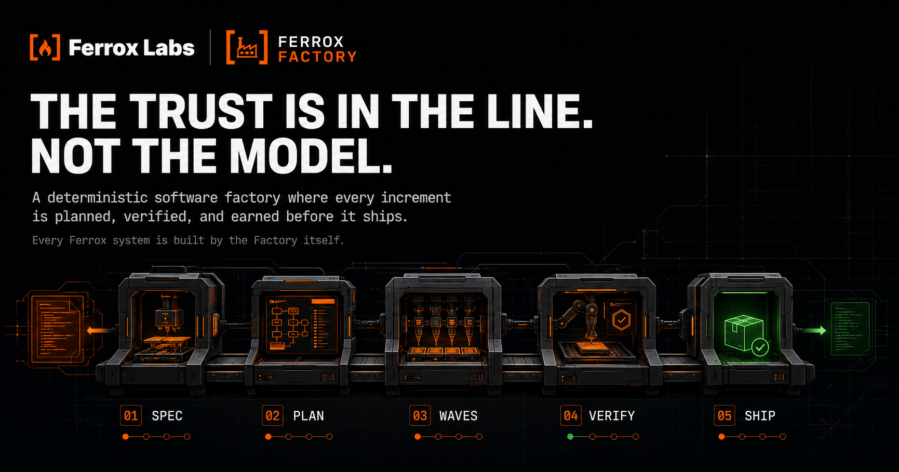
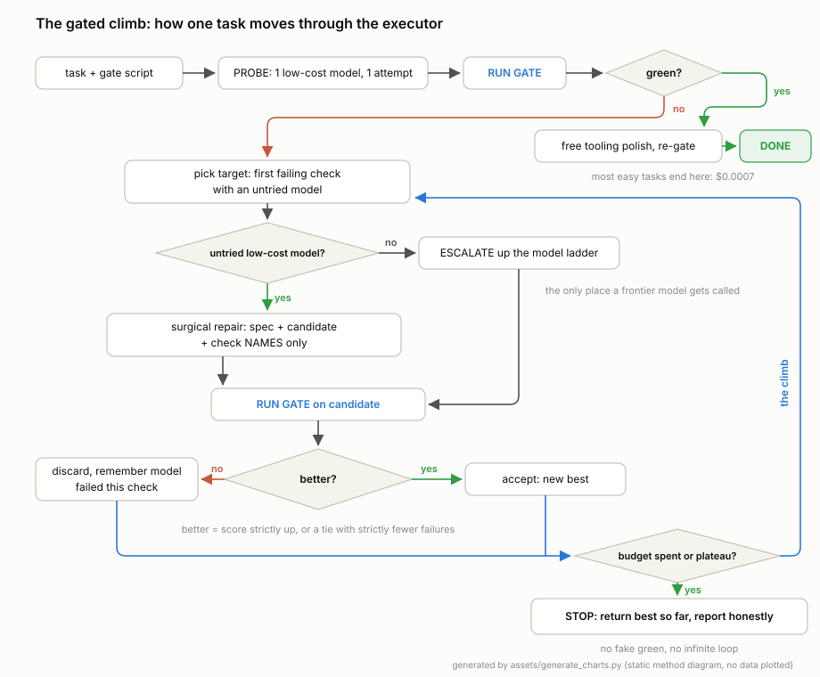
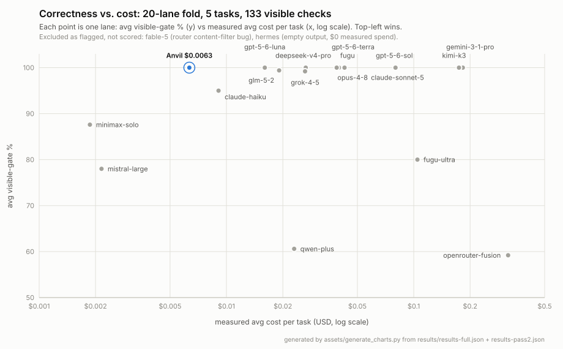
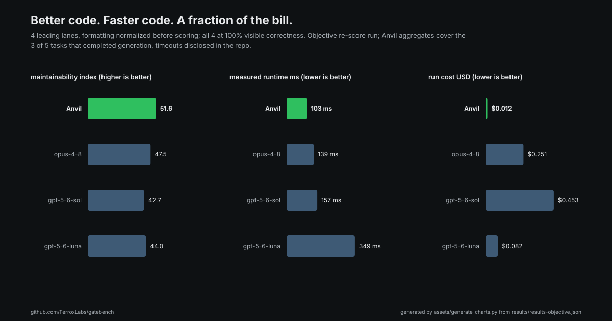
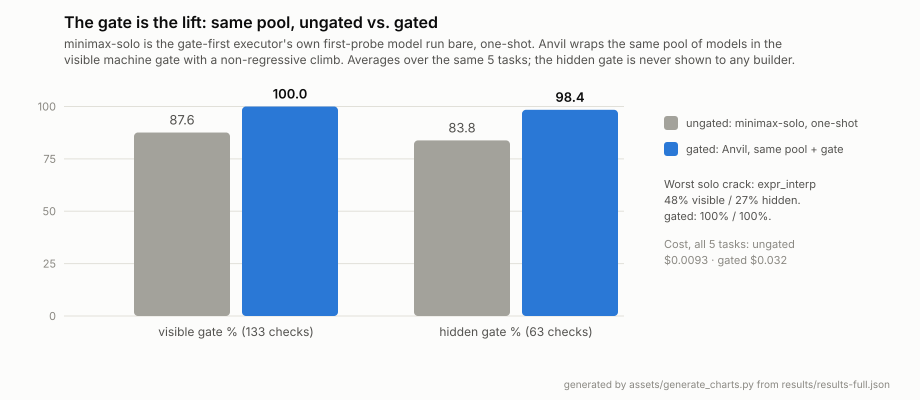
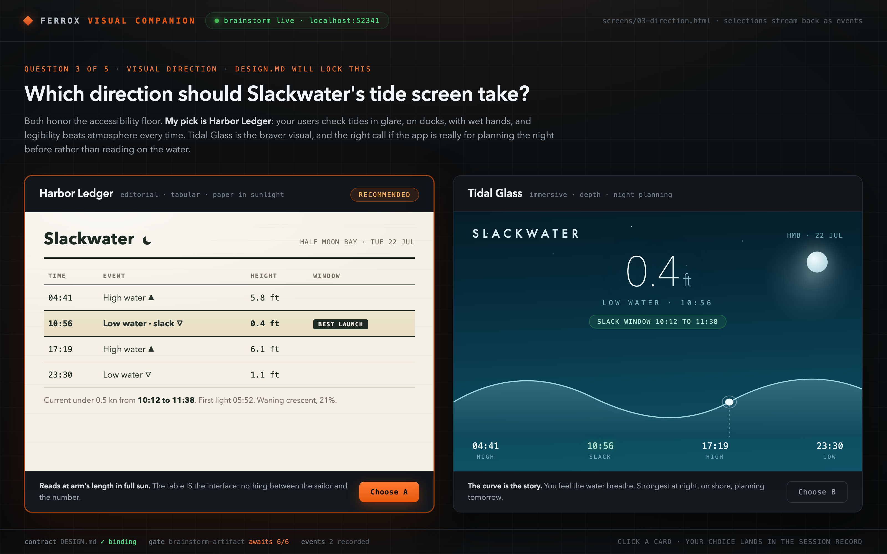

<div align="center">



# Ferrox Factory

**Go Build Something Awesome.**

*An agentic build line that turns specs into verified, shipped software: planned phases, parallel waves, machine gates at every station.*

[](https://www.npmjs.com/package/ferrox-factory)
[](LICENSE)
[](#testing)
[](https://discord.gg/hXwAcR4MyU)

</div>

---

## What is Ferrox Factory?

Every developer running coding agents has felt the same sickening moment: the agent declares
victory, you open the diff, and it is confident garbage. The model wrote fast, marked its own
homework, and moved on. Ferrox Factory exists to kill that moment. It is an agentic build line
where trust does not come from the model at all. It comes from the line itself: structure,
discipline, and machine gates that no agent can talk its way past. Work goes in as a spec. It
comes out as verified, committed, working software. There is no third state.

The line runs the way a real factory runs. A project becomes a roadmap, the roadmap becomes
planned phases, and each phase executes as waves of parallel sub-agents, each building in its
own isolated worktree under enforced rules: tests before code, atomic commits per task,
deviations recorded instead of improvised. Verification then works backward from the goal,
checking that the phase delivered what it promised, not that a checklist got ticked. Plans,
state, and handoffs live on disk, so the discipline survives context loss, session breaks, and
model swaps.

The whole line is hardened station by station: a context-engineered lifecycle (new-project →
plan → execute → verify → ship) fused with **anti-loop forcing functions**, a **fail-closed
merge gate**, **adaptive discipline depth**, **3-lineage cross-auditing on risky work**, a
**universal gate-first executor running the Anvil method natively**, and a **runtime-agnostic
model backbone**. Fleets of parallel sub-agents build real work without the infinite
*audit → fix → re-plan* loop that stalls naive agent systems.

It runs as **markdown skills + a Node CLI** (`ferrox-tools.cjs`) inside your existing agent:
Claude Code, Codex, Cursor, Kimi CLI, and 13 other runtimes. No new runtime, no lock-in.

The proof is the shipping record. This factory built **Wayland Desktop**, **Wayland Core**, and
the **Anvil engine**, whose gated climb now runs natively as the line's default execution path.
Then it built its own v1.8 through its own phases, gates enforcing, **714 checks green**.

> **The one guarantee, above all others:** the build line **always terminates and always moves
> forward**. Every working session ends in either a landed, coverage-advancing increment or an
> explicit, bounded stop (rescope, descope, or escalate to a human). Whatever else happens,
> **the build never enters an unbounded loop.**

---

## Why it exists

Every good spec-driven system gives you plan → build → verify. That is table stakes, and on a
clean, well-scoped task, table stakes are enough. Ferrox Factory is built for everything else:
the **machinery that matters when work goes wrong or gets big**, the failure modes that cost you
days, not minutes:

- **It cannot spin.** Halting caps turn "re-plan forever" into a bounded, terminating loop.
- **It will not merge un-evidenced work.** A fail-closed gate refuses any land without real receipts.
- **It cannot let the backlog rot,** or skip discipline on genuinely risky code.
- **It proves work against machine-checked gates.** The default executor is gate-first: candidates
  must pass real, deterministic checks before anything is accepted, and models escalate only when
  gates fail.
- **It routes cost intelligently:** low-cost frontier-class models for most work, expensive ones only
  where risk earns them, on any runtime.

That's the offer: a structural safety net for exactly the paths where autonomous agents usually
fall apart, enforced by the line instead of promised by the model.

---

## The core ideas

### 1. Adaptive discipline depth: spend rigor where risk earns it

Every planned increment is **risk-graded**, and the *process depth* scales to the grade. Not a
mode you toggle; a decision the system makes and can audit:

| | **Fast path** (low-risk: docs, config, UI) | **Full path** (high-risk: auth, crypto, payments, PII, deserialization, file paths) |
|---|---|---|
| Rituals | verify (test-after) + internal adversarial audit | RED-first TDD + mutation *or* cross-audit |
| Model | fast low-cost tier | frontier tier (forced) |
| Machine gates | **always on** | **always on** |

It **fails toward full**: anything it can't prove is safe gets the deep path. A boundary match (e.g. a
file under `src/auth/`) forces the full path *and* the frontier model *and* the cross-audit; a caller
can never downgrade past a boundary. The decision is written into the merge-gate evidence, so the grade
itself is auditable (no self-downgrading). The one deliberate exception is `/ferrox-fast`, a
human-invoked lane for trivial work that skips the ceremony: you choose it, the system never
selects it for itself.

### 2. The universal gate-first executor: the gated climb is the default path

The **gated climb** (the Anvil method, developed at Ferrox Labs) is the core execution discipline.
A **machine-checked gate** is a deterministic script that scores a candidate: it passes or it fails,
no opinion involved. The climb works like this: a low-cost model produces a candidate, the gate
scores it, and the executor escalates up your model ladder **only when gates fail**. It is
fail-closed (no green gate, no accepted candidate) and budget-bounded (a hard cost cap terminates
every run).

Since v1.8 this is the **default execution path**. Every phase routes through:

```
gate-select (20-domain registry)  →  eligibility  →  gate-first run (the gated climb)
```

- **gate-select** picks the strongest gate tier a domain admits, from a registry of 20 canonical
  domains (executable checks first, then formal, reference, and grounding checks).
- **Eligibility** confirms a real gate exists and the native executor is available. Both the fast
  and full discipline paths are eligible.
- **Fallbacks are fail-safe.** Subjective domains where objective gates can be gamed route to
  **Crucible**, an external judge-panel engine Factory consumes but never embeds. Anything else
  ineligible takes the normal executor path.
- **Trust boundary:** builder prompts carry only the identifiers of failing checks, never the gate
  source or expected values. The model cannot see the gate it must pass, only the names of the
  checks it failed.
- **Escape hatch:** `ANVIL_EXTERNAL=1` routes eligible Python single-file increments through an
  external Anvil install instead of the native executor.



### 3. Cross-auditing: the discipline, not a headcount

Work on the line is never graded solely by the agent that built it. That is the discipline:
**an audit by independent eyes wherever the work requires one**, and the eye count scales with the
risk. On genuinely high-risk work the adversarial review fans out across distinct model lineages,
in parallel:

```
  codex  ∥  gemini  ∥  internal-adversarial-subagent  ∥  ...as many eyes as the risk earns
 (openai)  (google)      (claude)
```

Fired concurrently, so wall-clock is the slowest single eye, not the sum. This caught real
vulnerabilities (double-decode traversal, NFKC-homoglyph path escapes) that single-model review missed.
When RED-first + mutation are already covered by the cross-audit, they're dropped as redundant: the
audit *is* the evidence.

### 4. The Flux Backbone: one key, every model, any runtime

Factory is **provider-agnostic**. Point it at any OpenAI-compatible endpoint (e.g. FluxRouter) with one
key and it routes every tier **and** the cross-audit panel through it:

```
model.backend  →  transport { flux | cli | host }  →  model-id from your ladder
```

A **degradation ladder** means it never breaks on a limited runtime:

1. **Provider key present** → route all tiers + the panel through the one endpoint (lowest cost,
   fastest, every model, works everywhere).
2. **No key, host CLIs present** → shell out to codex/gemini.
3. **Neither** → host-native model, internal-only audit (degraded, never broken).

Map your own **model ladder**: low-cost frontier-quality models (GLM 5.2, Kimi K3) as the default,
top-tier (Opus, Fable) reserved for the hardest judgment:

```jsonc
"model": {
  "provider":    { "type": "flux", "base_url": "<your endpoint>", "key_env": "FERROX_MODEL_KEY" },
  "tier_models": { "frontier": "opus", "near-frontier": "glm-5-2", "mid": "standard", "small": "fast" },
  "audit_panel": { "flux_models": ["reasoning", "glm-5-2", "kimi-k3"] }
}
```

The key lives **only in your environment** (`FERROX_MODEL_KEY`). It never enters config or code.

### 5. Anti-loop machinery: the build cannot spin

- **Halting caps**: a rescope cap (`hard-descope-or-kill`), a ship-clock, and an append-only
  `halting-log.jsonl`. A capped loop physically cannot run forever.
- **Fail-closed merge gate**: lands only when every required criterion is affirmative: valid receipts
  (or an audited fast/cross waiver), coverage advanced, ownership clean, hot-seam serialized, burn-down
  ok, zero open security/critical findings. Missing evidence = block, never a default-yes.
- **Generated-sync & burn-down floors**: the inventory can't lie about what shipped, and the backlog
  can't silently rot.

---

## Benchmarked, not vibed

We published the benchmark and the harness: **[gatebench](https://github.com/FerroxLabs/gatebench)**.
20 systems, 5 hard tasks, 196 machine checks (133 visible + 63 hidden that no builder ever sees),
per-call measured cost. Every number below traces to a raw results JSON in that repo, and the core
evidence re-verifies on your machine, offline, in seconds.

**Better:** the gated climb scored **100% visible / 98% hidden**, matching the best frontier lanes
on correctness. In the objective re-score (formatting black-normalized away, then ruff, bandit,
radon, and a runtime stress workload), it had the **highest maintainability (MI 51.6 vs 42.7 to
47.5)** and the **fastest measured runtime (103 ms avg vs 139 to 349 ms)** of the 4 lanes profiled.



**At a fraction of the cost:** $0.0063 a task. The next lowest-cost 100% lane ran at 2.5x; premium
frontier lanes ran **12.6x to 28.9x** for the same green checkmark. At 1,000 tasks a day that is
$6.34 against $16 to $183.



**And the gate is the lift.** The same model pool run ungated scores 88% visible / 84% hidden.
Wrapped in the gate, 100% / 98%. The hidden gate (never shown to any builder) is the
gate-overfitting control, and the gated pool holds 98.4% there, level with opus-4.8 on the same
checks.



**And it holds beyond code.** The v1.9 non-code lanes ran 2 non-code tasks (a release manifest
and a grounded research brief, 30 visible + 14 hidden checks total) through 3 lanes each. The
gated climb was the only lane green on all 44 checks. The frontier one-shot dropped 5,
including a placeholder signature on the manifest and ungrounded sentences in the brief. Both
climbs engaged organically: each first probe came back exactly 1 check short and was repaired
in-pool, no ladder escalation needed. Full traces, artifacts, and an offline verifier are
published in [gatebench](https://github.com/FerroxLabs/gatebench) (`verify_noncode.py`).

| task | lane | visible | hidden | measured $ |
|---|---|---:|---:|---:|
| release_manifest | **gated (Anvil)** | **16/16** | **7/7** | $0.0698 |
| release_manifest | ungated solo | 16/16 | 7/7 | $0.0088 |
| release_manifest | frontier one-shot | 14/16 | 6/7 | $0.0238 |
| grounded_brief | **gated (Anvil)** | **14/14** | **7/7** | $0.0615 |
| grounded_brief | ungated solo | 13/14 | 7/7 | $0.0021 |
| grounded_brief | frontier one-shot | 12/14 | 7/7 | $0.0114 |

Honest reading: these 2 tasks were near-saturated for the ungated pool (1 dropped check), so
the non-code climb bought certainty rather than a big lift, and at a higher per-task cost than
the solo lanes since the climb makes multiple calls. The claim these lanes support is precise:
the gate turns almost-green into green, catches the frontier one-shot's misses, and does it
for pennies. N=1 per cell, disclosed.

**The web-ui gate carries an external receipt of its own.** Run against the GDS 142-barrier
corpus, it hard-FAILed 22 of the 23 barriers inside its 7 claimed check families (95.7%, 0
missed) and routed the 23rd to the design eyes by contract. On all 142 barriers that is
15.5%, inside the 13% to 40% range GDS measured for 13 browser-driven tools, from a gate
that runs with no browser and refuses what it cannot claim; Deque's widely cited 57% is
percent of issue volume on real audits, a different base, quoted so the framing is
checkable. The same wave exposed 19 gate defects that were fixed test-first with 35
regression provocations.

The native v1.8 executor reproduced the discipline across 3 different domains through 1 verb:
release-manifest 16/16, grounded-brief 14/14, code parity 18/18 visible + 10/10 hidden, every
first probe green, $0.1246 for the whole proof wave. Charts are emitted by a committed,
self-checking generator that reads the raw results and refuses to draw on any mismatch.

---

## The gate library

The gates the climb runs against are a library, not a pile of scripts: 8 validated packs
(54 checks, 47 sealed mutants) ship in [`gates/`](gates/README.md), each with a Gate Card
declaring its checks, tools, validation status, and known gamed-modes. Since v1.12 the
library is template-keyed: a pack can carry separate sealed validation blocks per artifact
shape, and the first template-keyed pack gates both software and book brainstorm artifacts
with per-template semantics.

- **eval-harness-integrity**: trusts an eval harness only when it separates a gold stub, a
  random stub, and its own planted mutants in the declared order at the declared deltas.
- **test-generation**: scores a test suite by mutation-kill rate against the code under
  test, never by inspection; "tests pass" alone counts for nothing.
- **skill-instruction-files**: gates SKILL.md and agent instruction files on dead
  references, token budget, runnable examples, and contradictions.
- **spreadsheets**: recalculates workbooks headless and perturbs inputs to catch hardcoded
  totals that read as formulas.
- **brainstorm-artifact**: a hygiene floor on the brainstorm document's shape, keyed off
  the artifact's `template:` frontmatter: required sections in order, a definite
  recommendation, no placeholders, no dead references. The book template swaps in the
  fiction skeleton (Premise, World, Cast, Tone, Threads) and waives the dash ban inside
  prose, because dashes are correct craft in fiction; a declared template with no
  shipped pack fails closed.
- **web-ui**: the mechanical accessibility floor for frontend surfaces, computed statically
  from a self-contained HTML file: WCAG contrast ratios, 24x24 px tap targets, focus
  visibility, landmarks, heading order, alt and label decisions, reduced-motion fallbacks.
  Every check returns PASS, FAIL, or INDETERMINATE with a machine-readable reason code;
  INDETERMINATE never guesses and never silently passes, it routes to the design eyes as
  the judgment tier, and input outside the declared contract (self-contained HTML, subset
  selectors, `:root`-only custom properties) gets a distinct UNSUPPORTED-INPUT refusal. As
  far as we know, it is the first static a11y gate that computes contrast and tap targets
  without a browser.
- **lore-consistency**: the fiction floor. Scores a chapter against DECLARED bible facts
  only, from a fenced canon block the lore keeper owns: entities resolve, dead characters
  stay dead, timelines stay monotonic against the prior chapter, declared ages match the
  birthdate arithmetic, threads follow the ledger, the word floor holds. It never prints
  a bare PASS: the verdict is `LORE GATE: CONTRACT HONORED (N/M declared-fact checks)`
  with a scope disclaimer and the `canon_facts_hash` it was earned under. Prose quality
  is never gated; taste stays with the judgment eyes, on purpose and in the receipt.
- **citation-sources**: the research floor. Gates a report against a source ledger whose
  archived entries carry a verbatim excerpt and its hash captured at ingest: claim
  markers resolve honestly, retractions must be acknowledged, quoted spans match their
  excerpts verbatim under a locked normalization and alteration grammar (an ellipsis that
  hides a negation fails; an alteration beyond the grammar abstains as INDET and routes
  to the eyes). URL checking is syntax only; the gate never touches the network.

Every pack is validated to a sealed standard before it may gate anything: a pool of at
least 5 **fluent-but-wrong** mutant fixtures (convincing garbage a human skim would accept)
that the gate must catch, sealed in a content-addressed store outside the repo and rotated
per run so no builder can memorize them. The full standard, check inventories, and
authoring guide live in [`gates/README.md`](gates/README.md).

---

## Brainstorm mode: think it through before the line runs

`/ferrox-brainstorm` is the ideation on-ramp, and since v1.12 it holds 3 interaction
stances, chosen silently from your opening and never announced. The register just fits:

- **Guided**, for concrete decisions with real constraints: recommendation-first
  questions (every option set leads with a verified pick and the why; a bare option list
  is a defect), 2 to 3 genuinely different approaches, sectioned convergence.
- **Generative**, for blank pages: 1 easy intake batch where "not sure is fine", then
  the agent generates 4 to 6 concrete pre-checked options, each tied to your answers,
  and converges to a recommendation with a runner-up in reserve. Ask it to widen and it
  serves a fresh batch from a different axis AND discloses the class of options it
  silently discarded, so the filter stays inspectable.
- **Sounding board**, for creative thinking-out-loud: a collaborator, not a
  questionnaire. Say "I have this novel I keep circling" and you get someone who builds
  on the idea, follows your thread, and never serves an option list. Agreement is not
  free: every capture checkpoint carries exactly 1 concrete pushback with a named stake,
  so a long enthusiastic session still gets challenged. It recommends freely on craft
  and never on your story, your world, or your product facts; those are yours.

Steering is plain language: "just riff with me" or "what do you actually recommend"
pulls the register immediately, and your steering always wins over the automatic read.

The hard gate holds in every stance: **no implementation, no code, no scaffolding until
a design is approved**, no matter how simple the idea looks. Research on tap (2 to 4
parallel researchers returning comparison tables into the session) and the live visual
companion ride along as before.

**The exit is the intake.** Guided and generative sessions close on a GO gate; a
sounding-board session closes on a recap you bless: "sounds decided" vs "still open",
corrected in 1 move. Only exit-confirmed items become Decisions, each with provenance,
and the receipt is machine-tested: decisions flow into `/ferrox-new-project` with 0
re-asked questions. Parking is a successful exit, and every session leaves a resumable
record.

A real sounding-board session, mapping a cyberpunk novel from a thinking-out-loud
opening to a gated book-template artifact, is archived in-repo as a demo:
[`docs/demos/brainstorm-cyberpunk-novel/`](docs/demos/brainstorm-cyberpunk-novel/BRAINSTORM.md).



*A real companion screen: the agent presents 2 directions with its recommendation stated
first, you click, the session continues with your choice on record.*

## The declared-canon line

Since v1.13 a book and a research report run the same hardened line as software:
roadmap, phases, waves, gates, eyes, bounded stops, with the software stations swapped
for domain twins. `/ferrox-canon-init` writes the canon store (`LORE.md` for fiction,
`SOURCES.md` for research and nonfiction; both are legal in 1 project), and the store's
machine slice is 1 fenced block the lore keeper alone maintains, every entry checkable
with chapter:line provenance.

The trust split is the point: the chapter contract (POV, scene date, location, threads,
cast, word target, beats) is authored by the planner and injected into the trusted side
of the gate bundle by the orchestrator, so a draft cannot edit the contract it is graded
against. The floor gate then scores declared facts deterministically and hands exactly
what it refuses to judge, by name, to the continuity and method eyes. The receipt says
what it covered every single run:

```
canon_facts_hash: f0adf230a5316b0959c77e649a84a3279b902f5081d7b09748c529d3d2077d4a
LORE GATE: CONTRACT HONORED (9/9 declared-fact checks)
Scope: only declared facts were checked; prose canon fidelity outside the declared contract stays with the judgment eyes.
```

Change a birthdate in the bible and the retcon sweep voids every receipt pinned to the
old hash and re-earns them deterministically; in the shipped dogfood run the re-gate
flipped the verdict to `FAIL LC-06` until the contradiction was resolved on the record.
When the chapters clear, the manuscript assembler compiles `book/SPINE.md` plus
`book/chapters/` into `build/manuscript.md` with a compile report, and hard-errors on
any file the manifest does not own. The published numbers explain the design: the best
long-narrative claim-verification result is 55.8 percent (NoCha) and planted plot holes
are caught in at most 63 percent of stories (FlawedFictions), so this line refuses to
gate with a model that is right 6 times in 10 and gates with a pure function instead,
scoped to what was declared.

## The dynamic team

Since v1.13 the factory staffs itself. Finish a brainstorm, say GO, and before any plan
exists the line derives the team the work actually needs: not a domain template, not a
prebuilt roster, but roles read off the captured work shape the way you would state them
yourself ("for this I would need X, X, and X"). Each proposed role arrives with a 1 line
charter, a non-redundancy case for its seat (every specialist earns their seat, or the
roster collapses toward 1), and a recommended binding to an existing agent or a fresh
inline charter. You bless or edit the roster in 1 move, recommendation-first, and the
blessed roster is written to `.planning/TEAM.md`, the single team manifest,
hash-stamped so nothing downstream can drift from it silently.

The shipped demo continues the v1.12 cyberpunk-novel brainstorm into exactly that moment:
the roster below is the real validated artifact from
[`docs/demos/brainstorm-cyberpunk-novel/TEAM.md`](docs/demos/brainstorm-cyberpunk-novel/TEAM.md),
4 seats bound by reference to shipped agents and 1 chartered inline because no registry
agent carries the expertise (excerpted; the full manifest carries 5 roles):

```yaml
schema: team-manifest/v1
derived_from:
  brainstorm: cyberpunk-novel-2026-07-23
  milestone: wetlease-novel-v1
manifest_hash: 2217ce11a06339bb110997d935fb1afe78534f2229855ed1818a71629290778d
roles:
  - id: chapter-drafter
    charter: >-
      Draft and revise chapters against the planner-stamped chapter contract and the declared canon: salt-rot noir
      register, waterline settings, dialogue as bartering, every scene honoring the locked memory physics and the 3-week
      countdown.
    non_redundancy: Sole owner of the book/chapters/** write surface; the only seat that authors prose.
    binding:
      agent: ferrox-chapter-drafter
    owns:
      - book/chapters/**
  - id: memory-economy-specialist
    charter: >-
      Own the memory-property tech bible under book/tech/: work out the Ledger notary mechanics, custody-stamp format,
      render-tax arithmetic, and the forgery-verification asymmetry as internally consistent rules; propose tech canon
      to the lore keeper and review chapters for any scene where the technology breaks its own economics.
    non_redundancy: >-
      Distinct expertise and write surface: the lore keeper records blessed canon, this seat invents and stress-tests
      the tech economics under book/tech/** before anything reaches the canon store.
    binding:
      inline: true
    tier: frontier
    owns:
      - book/tech/**
```

The assembly receipt is machine output, never prose. The station runs the validator the
moment TEAM.md is written, and the dogfood run earned this line verbatim:

```
team-manifest/v1: 23/23 checks, 5 roles, 4 bound
```

The trust mechanics are the chapter-contract discipline generalized. The planner stamps
each staffed plan with the role id, the charter copied byte for byte, and the manifest
hash; execute-phase re-validates that hash against the live TEAM.md at dispatch time and
injects the charter as a trusted block on the generic executor. The executor echoes the
charter, never authors it, and the verifier fails any echo drift. A stale stamp stops
the dispatch with a named fix (re-stamp the plans or re-bless the roster), and a role
that vanished from the roster degrades the dispatch to roleless with a loud receipt,
never silently. Dispatch is always the same hardened executor: a role never swaps the
agent, it shapes the prompt and the model tier. The fixed gates and eyes are untouched
by construction: dynamic where creativity lives, fixed where trust lives.

From the dogfood run, the staffed plan's 3-key stamp as the planner wrote it:

```yaml
role_id: chapter-drafter
role_charter: >-
  Draft and revise chapters against the planner-stamped chapter contract and the declared canon: salt-rot noir register,
  waterline settings, dialogue as bartering, every scene honoring the locked memory physics and the 3-week countdown.
team_manifest_hash: 2217ce11a06339bb110997d935fb1afe78534f2229855ed1818a71629290778d
```

The dispatch preflight returned `{"verdict":"role", ...}` against the live manifest, the
executor's SUMMARY echoed the stamp, and the verifier's echo check passed it on the record:

```
role_id echo: ok
role_charter echo: ok, byte for byte (234 bytes)
ROLE-CHARTER ECHO: VERIFIED
```

This is graph engineering shipped as a product lifecycle, and the factory was doing the
practice before the term had a name: the lifecycle already builds a work graph (tasks
and artifacts as nodes, dependencies and handoffs as edges, receipts per node), and team
assembly is role-labeling that graph and matching agents to the labels. The research
validated deriving rosters from the work (AutoAgents, IJCAI 2024; AgentVerse, ICLR
2024); what those papers do not ship is the lifecycle around it, and that is the gap
this release closes: derive the roster from the work, staff the plan, execute under
fixed trust gates. Against the MAST failure taxonomy the claim is scoped honestly:
write-disjoint waves answer the inter-agent misalignment cluster, per-node receipts
answer the verification and termination cluster, and role-violation mitigation is
partial today (charter injection plus the verifier echo); per-role least-privilege tool
allowlists are the named follow-up.

## The ignition path

The whole line lights from 1 conversation: brainstorm the idea in whatever register
fits, say GO, and the artifact's exit-confirmed Decisions seed `/ferrox-new-project` as
given facts; plan the first phase, cross-review the plan, execute. That is the golden
path: brainstorm to GO to new-project to plan to cross-review to execute, with the
ideation artifact clearing a validated machine gate before it ever routes. The seam
carries a receipt: the intake test emits its counts in both interactive and auto modes,
decisions ingested 3 and re-askable 0 in each, with the interactive run additionally
skipping all 3 already-decided questions as off-limits, so "nothing gets asked twice"
is a measured claim, not a promise.

## The design stack: contract, knowledge, eyes

UI work runs through 3 layers that keep every agent on the same aesthetic:

1. **`DESIGN.md`, the contract.** `/ferrox-design-init` interviews you (or scans an
   existing codebase) and writes a 9-section design contract at project root: concrete
   palette values, type scale, spacing, components, motion, voice, accessibility floor,
   and a never-do list. Every entry is checkable without asking the author, and every
   UI-producing workflow treats it as binding. No more one-aesthetic-per-agent drift.
2. **The design intelligence, the knowledge.** The `ferrox-frontend-design` skill carries
   queryable datasets (palettes, typography pairings, Google Fonts metadata, UX
   guidelines, patterns, chart styles, a brand atlas) plus 12 direction templates and a
   search tool. The agent consults the knowledge, crystallizes decisions into DESIGN.md,
   and the contract binds from then on.
3. **The design eyes, the enforcement.** Independent critic agents review every UI
   artifact against the contract: a design critic (hierarchy, contrast, alignment,
   template-look detection), a WCAG design reviewer, a post-build accessibility auditor,
   and a 7-pillar UI audit including security headers. BLOCK findings stop the line until
   resolved or explicitly waived. Same doctrine as code: the builder never grades its own
   work.

---

## Installation

Ferrox Factory installs into your existing agent runtime, straight from npm:

```bash
# Claude Code, globally
npx ferrox-factory --claude --global

# Or scoped to one project
npx ferrox-factory --claude --local

# Other runtimes
npx ferrox-factory --codex --global
npx ferrox-factory --cursor --global
npx ferrox-factory --all --global       # every supported runtime
```

Or from a clone:

```bash
npm install && npm run build:lib        # once
node bin/install.js --claude --global
```

### How many commands you get

A default install writes all 74 commands, so nothing you read about is ever missing. If that is
more surface than you want, install a smaller set:

```bash
npx ferrox-factory --claude --global --profile=beginner   # 18: the whole loop, nothing expert
npx ferrox-factory --claude --global --profile=standard   # 27: adds onboarding and workspaces
npx ferrox-factory --claude --global                     # 74: everything (default)
```

`beginner` covers the 9 questions a first project raises: what to build, build it all, where am I,
plan a step, build a step, did it work, send it, it broke, put it back. The base list is 9 names and
the installed set is 18, because a profile resolves to the transitive closure over each command's
declared `requires:`.

`--minimal` and `--core-only` are back-compat aliases for `--profile=core`.

Whichever you pick, `/ferrox-help` opens on the 9 that carry a project end to end, and the rest stay
out of the way until you ask for them.

**Supported runtimes:** Claude Code · Codex · Cursor · Windsurf · Kimi CLI · Kilo · Copilot ·
Antigravity · OpenCode · Augment · Trae · Qwen · Hermes · Cline · CodeBuddy · ZCode · Pi: 17 in
all. Instruction-file and hook support are best-effort per runtime; Claude Code is first-class
(worktree isolation, sub-agents, interactive questions).

Uninstall anytime: `node bin/install.js --claude --global --uninstall`.

**Install precedence: keep 1 copy.** A global install (`~/.claude`) and a project-local
install (`<project>/.claude`) can coexist, and when they do, the global copy's CLI
shadows the project-local one, so the 2 copies can drift to different versions and
configs while the local one sits unused. The CLI warns when it detects shadowing (at
most once per 12 hours per project), and `ferrox-tools doctor` prints the full picture
on demand: both install paths, both versions, which copy is actually running, a
dependency self-check, and the exact uninstall command for whichever copy you drop.

---

## Quick start

After install, restart your agent, then drive the line with `/ferrox-*` commands (or ask your agent to
run the matching skill):

| Command | Use it for |
|---|---|
| `/ferrox-brainstorm` | research brainstorm with the live visual companion, hard design gate |
| `/ferrox-design-init` | write DESIGN.md, the binding design contract for all UI work |
| `/ferrox-new-project` | initialize a project (PROJECT.md, ROADMAP.md, config) |
| `/ferrox-canon-init` | write the declared canon store (LORE.md or SOURCES.md) that gates creative work |
| `/ferrox-plan-phase N` | plan a phase into executable PLAN.md files |
| `/ferrox-execute-phase N` | build a phase with wave-based parallel sub-agents |
| `/ferrox-quick` | a small fix with atomic-commit + state guarantees, minimal ceremony |
| `/ferrox-fast` | a trivial task inline, no planning overhead |
| `/ferrox-debug` | systematic debugging with state that survives context resets |
| `/ferrox-code-review` | changed-file review for bugs, security, quality |
| `/ferrox-ship` | PR + merge-gate before landing, review when configured |
| `/ferrox-help` | the full command guide |
| `ferrox-tools doctor` | report both installs, versions, shadowing, and dependency health |

---

## Configuration

Per-project config lives in `.planning/config.json`. Highlights:

- **`model.stage_tiers`**: which *kind* of work maps to which tier (`grunt`→small, `verify`→frontier).
- **`model.tier_models`**: the tier → model-id ladder (your model economy; arbitrary rungs).
- **`model.provider`**: the OpenAI-compatible endpoint + key env-var (the Flux Backbone).
- **`model.risk_boundaries`**: path/category tokens that force the full path (default: auth, crypto,
  payments, pii, deserialization, network-file).
- **`halting`**: rescope cap, ship-clock, cap outcomes.
- **`workflow.use_worktrees`**: git-worktree isolation for parallel waves.

Run `/ferrox-config` for a guided walkthrough.

---

## Architecture

- **Markdown skills + Node CLI.** Workflows are markdown the agent reads; deterministic logic lives in
  `ferrox-tools.cjs` verbs (halting, coordination, strength/merge-gate, model routing, memory).
- **Build-at-publish (ADR-457).** TypeScript sources in `src/*.cts` compile to the runtime artifacts
  `ferrox-core/bin/lib/*.cjs` via `npm run build:lib`. The `.cjs` are build outputs (gitignored); a
  fresh clone runs `npm run build:lib` before use.
- **Pure cores, impure shells.** Decision logic (risk grade, discipline depth, merge gate, gate
  selection, the gate-climb state machine, model backend, audit panel) is pure and unit-tested
  throughout; the CLI/router is the thin impure edge.

<a name="testing"></a>
### Testing

```bash
npm run build:lib && npm test
```

The suite is **1254 tests (1247 passing, 7 environment skips)** across the halting, coordination, strength, model-routing, memory,
Flux-backbone, and gate-first executor layers. Cores are developed test-first, with RED captures
and mutation receipts backing the merge gate's evidence.

---

## Credits & License

Ferrox Factory is **MIT-licensed**. It began life as a fork of
[GSD](https://github.com/open-gsd/gsd-core) before growing into its own line, and it vendors
per-task discipline skills adapted from Superpowers; both are credited per the MIT terms in
[`NOTICE`](NOTICE). See [`LICENSE`](LICENSE).

<div align="center">

**Built by [FerroxLabs](https://github.com/FerroxLabs).** · [Join the community](https://discord.gg/hXwAcR4MyU)

</div>
